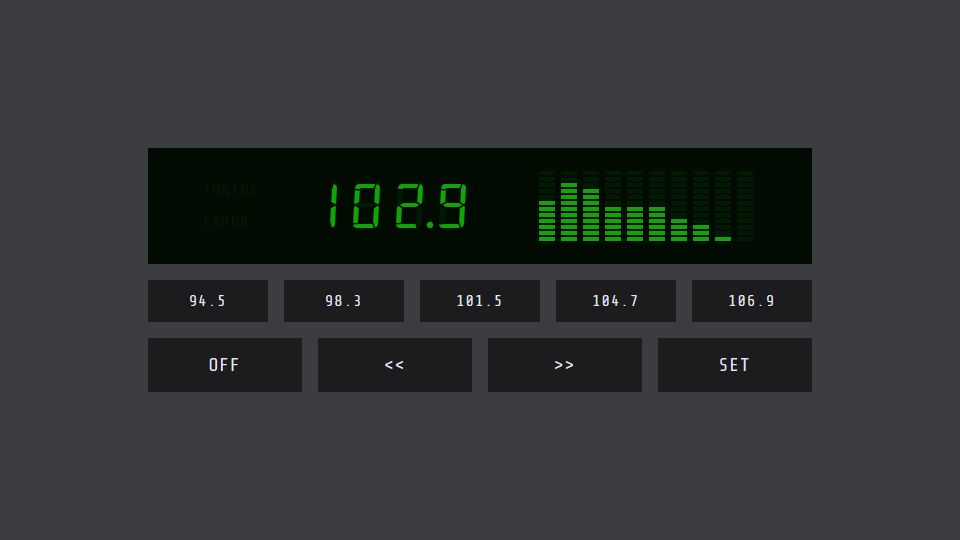

# Online Radio

https://chrispalmeri.com/radio/

As tuned in Saint Marys, Kansas. Not an actual radio. Uses data from publicly accessible HTTP streams. Results may vary based on browser and device. Saves current station and preset info to your device.

## Advanced

Keyboard | Shortcut
---|---
`Spacebar` | ON/OFF toggle
`Left Arrow` | Previous station
`Right Arrow` | Next station
`Shift` | SET toggle
`1` | Preset 1
`2` | Preset 2
`3` | Preset 3
`4` | Preset 4
`5` | Preset 5
`-` | Half volume
`=` | Full volume
`,` | Previous color
`.` | Next color

From Developer Tools console in browser.

  * `settings.color('#27b7dc');` or any hex color
  * `settings.volume(0.5);` or any value between 0 and 1
  * `settings.visualizer(false);` or true

## Issues

  * Crashes tab sometimes
  * Plays half speed occasionally and visualizer is frozen
  * wrong scale initially (on one mobile device)
  * larger bottom margin (on one mobile device)
  * Visualizer only occupying the first 7 columns on one machine, weird

## To do

  * pass more data around vs including modules everywhere
  * index.html still has canvas
  * more than two levels of keyboard volume
  * keyboard presets are kinda hacky, also allow ten
  * clean up visualizer on/off code
    * also the waterfall down was kinda cool
  * More responsive design
  * Debug option (for lcd off color mostly)
  * Link back to v1
  * Merge
  * Add settings to storage
  * Build system
    * npm for rollup and replace vagrant
  * console log error and fallback
  * Display one large svg (can you still have fade in?)
  * Load your own JSON
  * Help text
  * Tone control
  * add seek animation
  * dual zone lighting
  * day/night toggle
