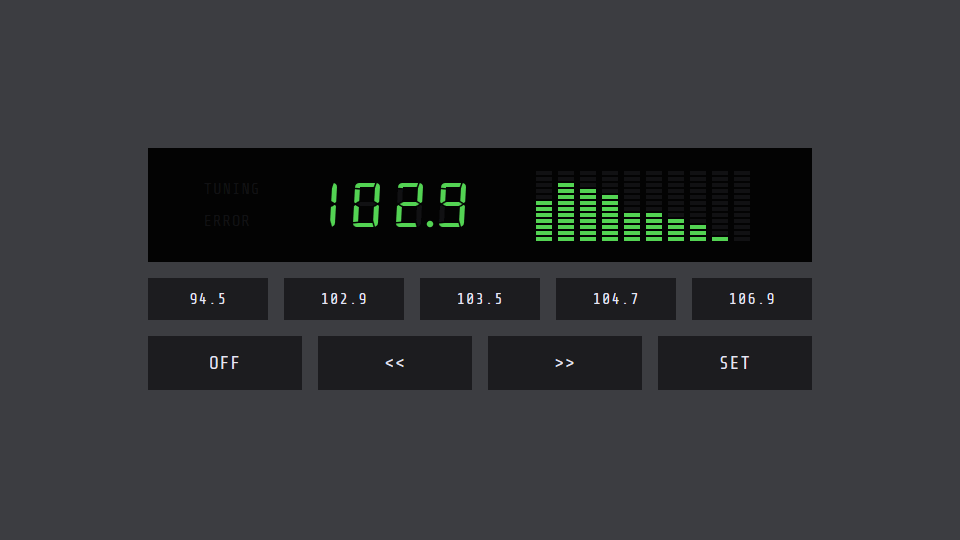

# Online Radio

https://chrispalmeri.com/radio/

As tuned in Saint Marys, Kansas. Not an actual radio. Uses data from publicly accessible HTTP streams. Results may vary based on browser and device. Saves current station and preset info to your device.

## Advanced

`led.color('#27b7dc');` from Developer Tools console.

## Issues

  * Crashes tab sometimes
  * Plays in slow mo occasionally and have to reselect that station to fix
  * wrong scale initially on mobile
  * larger bottom margin on mobile

## To do

  * Link back to v1
  * console log error and fallback
  * More responsive design
  * Option to disable visualizer
  * Keyboard shortcuts
  * Add led color to storage
  * Volume control
  * Load your own JSON
  * Help text
  * Tone control
